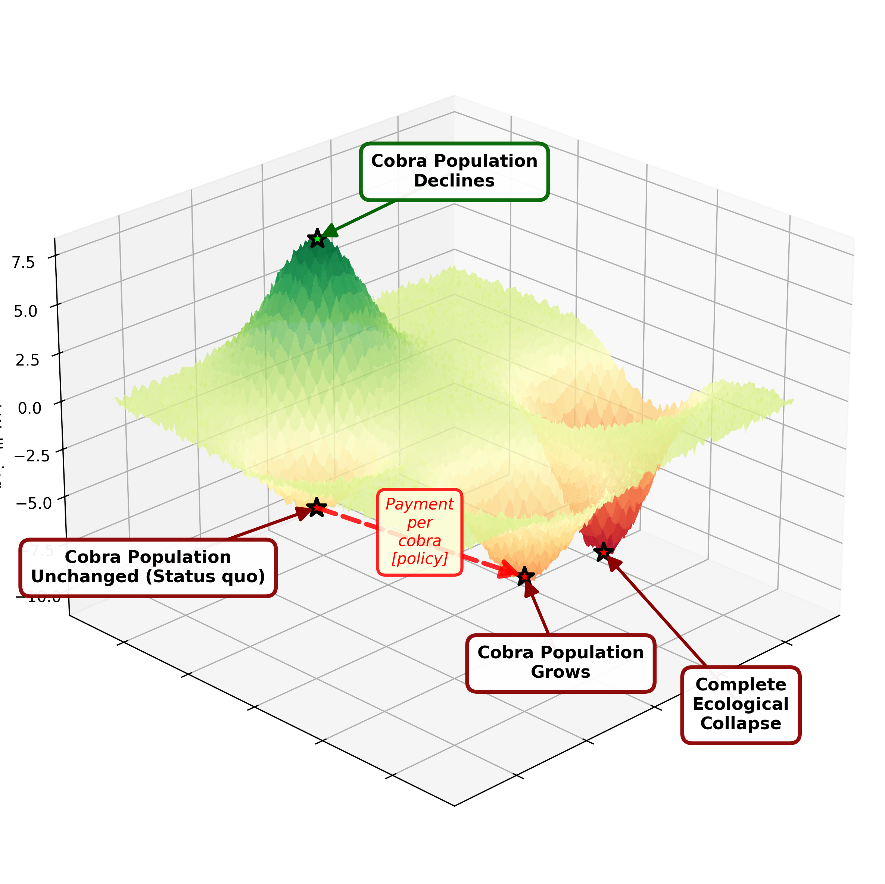

# Applying the moral framework
To apply the framework to any decision around policy we have to enumerate the possible types of consequence we could expect as a side effect of the policy. We then need a way to objectively compare the harm caused for each consequence.

# Moral Arithmetic
To compare one moral action to another we have to place some relative values on different aspects of the human condition. 

| Item | Psychological (0–100) | Physical (0–100) |
| ---- | --------------------: | ---------------: |
| Death (self) | 70 | 100 |
| Death (other, witnessed/caused) | 70–100 | 0–20 |
| Severe torture (prolonged, intentional) | 80–100 | 80–100 |
| Acute physical pain (short duration) | 5–30 | 10–60 |
| Chronic physical pain | 30–80 | 30–80 |
| Severe injury (permanent disability) | 40–90 | 60–90 |
| Minor injury | 1–10 | 1–15 |
| Sexual assault | 70–100 | 10–60 |
| Psychological torture / coercive control | 60–100 | 0–20 |
| Extreme fear / terror | 40–80 | 0–10 |
| Non-clinical anxiety | 1–10 | 0 |
| Clinical anxiety disorder | 20–70 | 0–10 |
| Major depressive episode | 40–90 | 0–20 |
| Loss of autonomy / imprisonment | 30–80 | 10–40 |
| Social isolation / ostracism | 20–60 | 0 |
| Humiliation / degradation | 10–50 | 0 |
| Grief (loss of close relation) | 40–90 | 0–10 |
| Betrayal by trusted individual | 30–70 | 0 |
| Threat of harm (credible) | 20–60 | 0–5 |
| Economic ruin / loss of livelihood | 20–70 | 0 |
| Mild inconvenience | 0–2 | 0–1 |
| Loss of property | 5–20 | 0 |
| Violation of privacy | 5–30 | 0 |
| Forced displacement / exile | 40–80 | 10–40 |

It seems only appropriate that for many of these we use a scale to show the range of possible values.

The values above are likely to be fiercely debated, but they do exist and they are comparable. It's clear that we can agree to a relative comparison between extremes. Take the comparison between being called a name vs being violently tortured.

We can clearly see that one must be worse than the other intuitively. We would also have no trouble in declaring that someone claiming the reverse, is being patently absurd. While an individual may *subjectively* experience a trivial insult to be worse than torture, we would likely declare their mind sufficiently faulty as to exclude their opinion from our discussion.

Other comparisons are not as clear, and the subjective experience varies so widely that a general rule would be hard to come to. In these cases we will have to rely on empirical data where possible to try to generate an average level of relative suffering.

# This seems unrealistic or infeasible
Your immediate thought when looking at this table might be that this is cold and unrealistic, that we can't put a numeric value on levels of harm. 

If we look at the legal systems of any society however, we find that this is precisely what we do. We apply a moral value to crimes and punish the perpetrator accordingly. In some cases going so far as to sanction death. 

There is no reason to suppose that we can't do that ahead of time when talking about the likely negative and positive outcomes of policy decisions at a statistical level.

# What about in *this* situation?
There will always be individuals, sufficiently harmed by a policy - that if looked at in isolation we would have the desire to change policy. These outliers have to be balanced against the positive well-being of society as a whole. 

Our goal is to maximise *overall wellbeing*, and if the nature of a policy is such that it raise everyone's wellbeing collectively by the same amount then that is the ideal. 

If it is such that the *best* policy we can design disadvantages 1% of the population in some way, but benefits the remainder substantially. We must apply that policy.

The alternative is to neglect the majority for the sake of a minority. 

## Example
As a society we have decided that the physical and psychological harm of murder is too great to tolerate. As such we have created a law (policy) that states that no individual may commit unprovoked murder. 

Imagine those who are born with a neural defect. This defect causes one and only one desire above all else: the desire to murder as many people as possible.[^2]

We have intentionally reduced their wellbeing for the sake of the majority. These people had no control over the fact they were born with homicidal desires. They will never go fulfilled, and will live life in a state of psychological torment.

No one will argue in this situation that the needs of the many should be sacrificed to benefit this small minority. But on very similar moral arithmetic problems, people come to all sorts of bizarre conclusions. This is a testament to the power of the individual over statistics, when fed as inputs to the evolutionary moral heuristics.

## Psychological harm must be remembered
Again it's critical to state that the psychological harm to society must be included in our moral arithmetic. There are many policies we don't adopt even though the net harm for society might go down (excluding psychological), purely because we, as biological end products of evolution, cannot tolerate the outcome of that policy. E.g. harvesting organs from one to save 10.

If we were a society of humanoid robots that had no sense of evolutionary morality, it is quite imaginable that one robot would joyously be sacrificed for its parts to be shared among 10, and that there would be no objective basis for calling that act immoral. We actually do this all the time in junkyards, precisely because there is no collective of cars that would suffer great psychological harm from the act.

# Policy abuse
While we don't want to be unduly bound by the smallest edge case when making generalised policy decisions, there is a class of edge cases that *must* be considered. These revolve around abuse of the system. By looking only (or mostly) in generalities we open ourselves up to the possibility of abuse by bad actors. 

Logically it can be predicted that: 

- Given a population with some people who are selfish
- When an opportunity is provided that will allow the selfish to gain, they will take it
- If that selfish act causes societal harm (i.e. [external costs](https://en.wikipedia.org/wiki/Externality)), the aggregate wellbeing of the society will have gone down.
- The abuse is not self limiting, it will continue until the system collapses or there is a change of policy.

So given our moral framework, we must consider these edge cases when designing policy.

## Perverse incentives
This failure of safe-guarding a policy against bad actors presents itself in the form of perverse incentives. The most commonly used example is of the monetary reward for capturing cobras. Whereby the attempt to reduce the snake population actually led to an increase in snakes.

By offering money as a reward for handing in dead cobras, people looking to maximise their own wellbeing (with no regard to the wellbeing of others), began breeding cobras in order to collect the reward.

We can model this on a moral graph.



<details>
<summary>Code</summary>

```yaml moralgraph
landscape:
  title: ""
  resolution: 150
  x_range: [-5, 5]
  y_range: [-5, 5]
  noise_level: 0.15

  axes:
    zlabel: "Total Wellbeing"

  style:
    colormap: "RdYlGn"
    figsize: [14, 10]

peaks:

  - coords: [1.0, -3, 7]
    label: "Cobra Population\nDeclines"
    label_offset: [0, 4, 6]

troughs:
  - coords: [1, 3, 6]
    label: "Cobra Population\nGrows"
    label_offset: [1, 2, -2]

  - coords: [3, -1, 4]
    label: "Cobra Population\nUnchanged (Status quo)"
    label_offset: [2, -3, -4]

  - coords: [-3.5, 1.0, 10.0]
    label: "Complete\nEcological\nCollapse"
    label_offset: [0, 4, -5]

moral_actions:
  - source: "Cobra Population\nUnchanged (Status quo)"
    target: "Cobra Population\nGrows"
    label: "Payment\nper\ncobra\n[policy]"
    color: "red"
    linewidth: 3.0
    linestyle: "--"
    alpha: 0.85
    z_index: 4

render:
  output_file: "snake_outcomes_graph.png"
  dpi: 300
  view:
    elevation: 25
    azimuth: 45
```
</details>

We can see that by implementing this policy decision, those responsible thought they were ascending to a new peak on the landscape. They instead fell directly into a valley. It is also foreseeable that a different policy could have even more drastic outcomes, for example total ecological collapse.

[^2]: This is not necessarily the cause of all murderers choosing to murder, it is simply an example to illustrate the point.