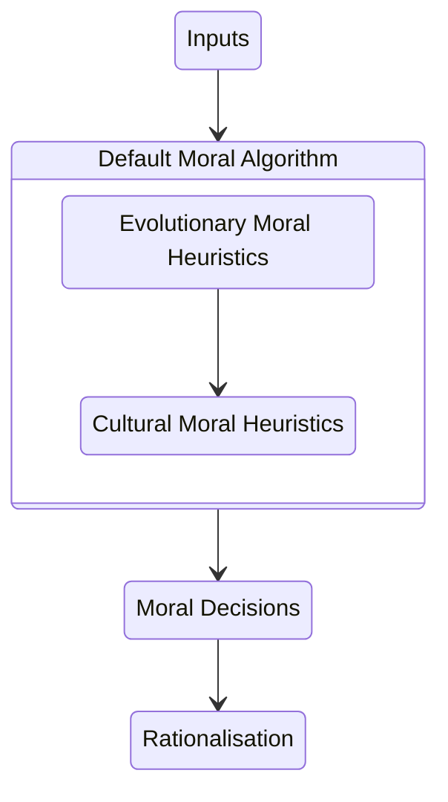
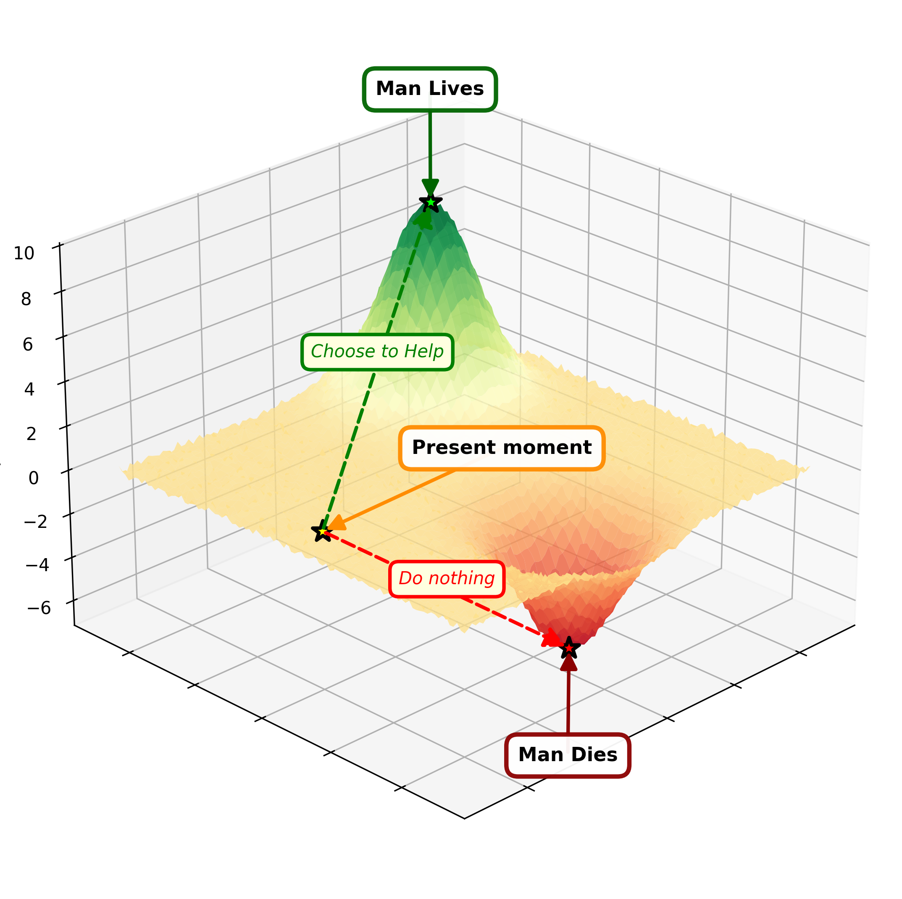
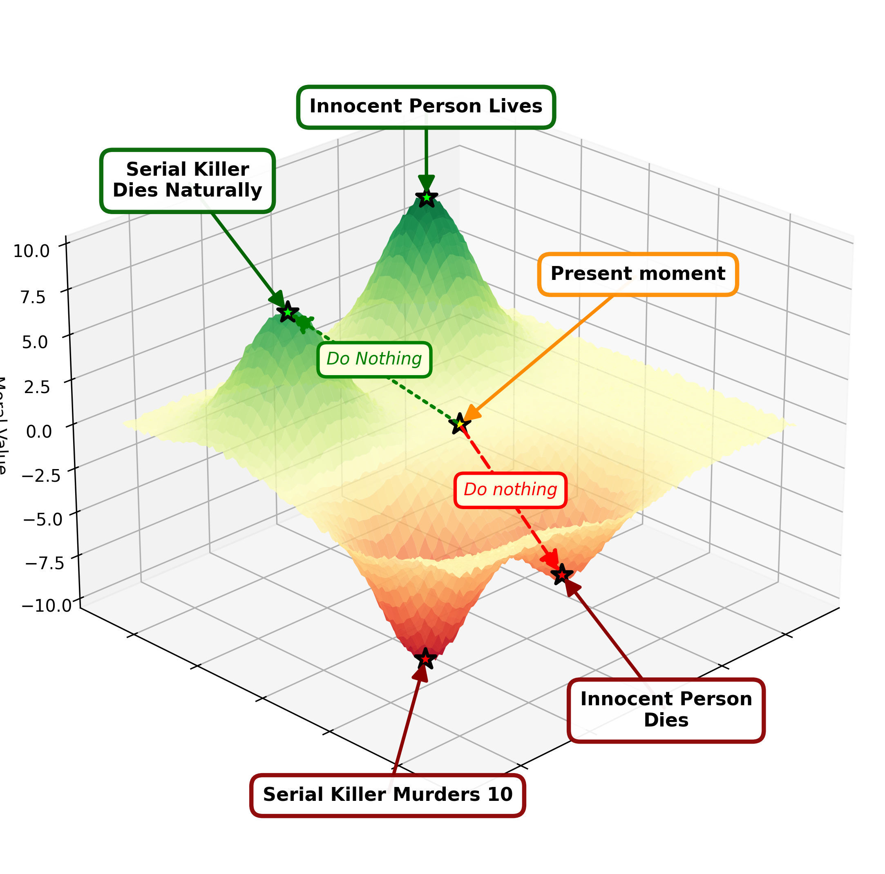

# Intro

Politics is rife with some of the worst critical thinking imaginable.

We have had centuries of reflection and study of the mind, through which we have come to understand the flawed ways the human brain processes information. 

Still, due to a lack of education, cognitive biases, and many other reasons, we still struggle to understand and action the knowledge we have attained through hard fought analysis, scientific study, and trial and error.

My goal is for this repository to be a collection of objectively defined political beliefs. I want it to be a collection of living documents that are updated as new information comes to light.

> “The measure of intelligence is the ability to change.”
>
> — Albert Einstein

> “Don’t cling to a mistake just because you spent a long time making it.”
>
> — Aubrey de Grey

# Objectivity
It is important to define for our purposes objectivity and subjectivity.

This repository is supposed to be deterministic and objective. That is to say, that:
- With all the same input data[^7] (scenario/decision under discussion, facts, scientific knowledge, etc)
- Following the moral methodology outlined below
- Any person (or machine) would have to agree that the conclusions drawn are logically the most optimal course of action[^5].

In addition, it would necessarily mandate that to come to any other conclusion would mathematically require a change to the inputs (new facts, knowledge etc). In this context the most contested elements would likely be weightings and uncertainty (themselves inputs). [^1]

Subjectivity when it comes to politics, usually just means: "for a question that arises I will simply answer how I feel in the moment". If your conclusion is based on your feelings, then your opinion holds an equal value to all other feelings based opinions on the topic.

# Moral basis
Many political choices come down to making the *moral* choice. This is impossible to do objectively without a concrete understanding of how one objectively determines what is moral and what is not.

Unlike the science of physics and chemistry, there can be no truly objective moral guiding principle that can be studied in a lab, so we must define an objective process or algorithm for determining the moral value of an act or policy.

## Default Moral Heuristics
Most people don't even consider how they come to their moral conclusions. For many it's an immediate, gut instinct reaction. The first constituent of this reaction I will refer to as the *evolutionary moral heuristic*. These are a set of moral values that have evolved in humans over time, and are universal across all cultures (and even some [intelligent animals](https://en.wikipedia.org/wiki/Inequity_aversion_in_animals)).

On top of this come the *cultural moral heuristics*. These are ingrained into us as children and adolescents (usually from our parents, relatives, teachers, local area, media, government, etc) and rarely change dramatically over time.

<div align="center">



</div> 

These two layers of moral heuristics are not chosen by you. You didn't choose where you were born, and you didn't choose to be born a human.

The fact that these are natural to each person does not mean that they infer any sort of correctness. They simply *are* what each person has as a foundation to their moral calculation algorithm.[^12]

## Post-hoc Rationalisation
The challenging part for someone attempting to deploy these natural heuristics is that they are usually tacit, and replete with logical fallacies and contradictions. This often lead people to display blatant hypocrisy when pressed during debates.

That is because the outputs of the moral algorithm are then processed through our brains to *justify* our moral decisions - whether they are logical or not. [^2]

For most people this is the full and complete content of their algorithm. My goal is to replace (as much as is humanly possible[^6]) of the Default Moral Algorithm, with one based in objectivity. 

# An Objective Moral Basis

To my knowledge the closest we can come to a scientific understanding of morality is the framework that Sam Harris lays out in [The Moral Landscape](https://en.wikipedia.org/wiki/The_Moral_Landscape). 

In my mind, this framework provides a way of understanding the moral impact at the lowest level of a single person's action, all the way to the most grand and sweeping actions of nation states. 

I also believe that it is capable of encapsulating all other concepts of morality (religion, values, culture) in an abstract sense, by considering them instruments to facilitate reaching a higher peak on the moral landscape when operated through the illogical, biological function of the human mind.

## The Moral Landscape
The central premise of the moral landscape is

> (1) some people have better lives than others, and (2) these differences are related, in some lawful and not entirely arbitrary way, to states of the human brain and to states of the world.
>
> — The Moral Landscape

To put this more simply and to centre it on the human experience

1. **Humans can experience positive and negative states of being** [^3]

A person can be tortured and in great pain, or they can be living a life of luxury and ecstasy, or any number of intermediate and hybrid states. 
 
2. **There are concrete steps that we can take that will change the state of being for humans**

If a man is starving and hypothermic, we know that there is an almost guaranteed *positive* outcome to his well-being if we feed him and bring him into the warmth.

With these premises in mind we can model reality as a landscape, with peaks and troughs. We can traverse the landscape by taking actions. This could lead us in a positive (higher in elevation), negative (lower in elevation), or neutral direction.

### Visualising the Moral Landscape
We can represent this homeless scenario on the moral landscape like so.



<details>
<summary>Code</summary>

```yaml moralgraph
landscape:
  title:
  style:
    colormap: RdYlGn
  
peaks:
  - coords: [-2, -3, 9]
    label_offset: [0, 0, 5.0]
    label: "Man Lives"
  
neutrals:
  - coords: [4, 0, 0]
    label_offset: [0, 5, 7]
    label: "Present moment"
    z-index: 5

troughs:
  - coords: [0, 3, 6]
    label_offset: [0, 0, -5.0]
    label: "Man Dies"
  
moral_actions:
  - source: "Present moment"
    target: "Man Lives"
    label: "Choose to Help"

  - source: "Present moment"
    target: "Man Dies"
    label: "Do nothing"

render:
  output_file: "homeless_scenario1.png"
  view:
    elevation: 25
    azimuth: 45
```

</details>

I will refer to this representation as a *moral graph*. 
From this example we can see that *inaction* is a morally salient act. We cannot assume that to take no action is morally neutral[^14]. This is frequently not the case.

### Adding knowledge can make the same action morally opposite
Importantly we can see that it is *almost* guaranteed that feeding and sheltering the homeless man is morally positive, but not for certain. For if that man was a serial killer, intent on murdering innocent people, the moral action may be that we leave him there to die.



<details>
<summary>Code</summary>

```yaml moralgraph

landscape:
  title:
  style:
    colormap: RdYlGn
  
peaks:
  - coords: [-2, -3, 9]
    label_offset: [0, 0, 5.0]
    label: "Innocent Person Lives"
  
  - coords: [3, -2, 7]
    label_offset: [0, -3, 5.0]
    label: "Serial Killer\nDies Naturally"

neutrals:
  - coords: [0, 0, 0]
    label_offset: [0, 5, 12]
    label: "Present moment"
    z-index: 5

troughs:
  - coords: [0, 3, 6]
    label_offset: [0, 3, -5.0]
    label: "Innocent Person\nDies"
  
  - coords: [3, 2, 9]
    label_offset: [4, 3, -1.0]
    label: "Serial Killer Murders 10"

moral_actions:
  - source: "Present moment"
    target: "Serial Killer\nDies Naturally"
    label: "Do Nothing"
    linewidth: 2.0
    linestyle: dotted
    color: green

  - source: "Present moment"
    target: "Innocent Person\nDies"
    label: "Do nothing"
    color: red
  
render:
  output_file: "homeless_scenario.png"
  view:
    elevation: 25
    azimuth: 45
```

</details>

## Common concerns
Below are some common concerns about the above basis for morality that I have seen and why I don't consider them important.

### What if a genocide for one group produces greater outcomes for another group?

It is very hard to imagine a scenario where the negative outcome of the genocide of a people could be outweighed by the positive improvement of others.

Given that our goal is to derive the positive most likely positive outcome for the greatest number of humans, genocide would be very hard to justify. Hard but not impossible.

Looking at an example that is less tied to emotion and human history, it becomes clear that we make these moral calculations all the time.

#### Mosquitos

We make great efforts to eradicate mosquitos, how is this morally justified? because we have calculated the morality of decimating the mosquito population vs not decimating them. 

- If we don't eradicate mosquitos, millions of people will die. 
- If we do eradicate them, millions will not.

We know this to a degree of certainty higher than reasonable doubt.
We also go to great lengths to make sure that we don't disrupt the ecosystem in this calculation too (exploring the moral consequences of each outcome as fully as possible).

These types of moral calculations are all too easy for us to do when the targets are non-human animals. Invasive species are culled in unfathomable numbers every day, because we have carried out a moral calculation that it would be better to have no invasive species in our environments.

#### War
Now if we shift back to humans, we see that we already sanction murder on a mass scale during exigent circumstances. We routinely kill many people in wars, including civilians, because we have determined it to be the least morally negative act.

The idea that rational moral calculation, necessarily leads to a slippery slope that eventually ends in genocide is not borne out by reality. The fact we already do these calculations on a regular basis provides us the experimental evidence we need to dismiss this. (Let alone the alternative is *irrational* moral calculation?)

War necessitates eradication of the opposition's army, if your country is being invaded you will find very quickly that you're suddenly OK with mass killing. If an entire population fights tooth and nail to the very end, then you will likely carry out a genocide whether you like it or not.

When people often discuss genocide they are usually subtly implying *arbitrary* genocide which would have no moral foundation under this framework.

#### Murder

On a smaller scale, we also come to moral conclusions about *murder* all the time. A terrorist hijacks a plane and intends to fly it into a building. 

Is it moral to execute the terrorist if that is the only option at hand? Of course it is.

This also aligns easily with our evolved moral heuristics which is why most people do not have a problem with the above conclusion. 

It is also likely the most moral decision to shoot the plane out of the sky killing all passengers onboard, for the purposes of saving thousands outside the plane. This act does not *feel* as obviously morally correct, through the lens of our evolved moral heuristics, because mechanisms of mass murder did not exist when our brains evolved.

### This feels too cold
Any feeling that you cannot put into a cogent logical argument, is likely your inbuilt, evolved moral heuristics kicking in.

These have evolved to allow you to negotiate life as a hunter-gatherer, occasionally encountering other humans on your travels. You're the product of a system that operated in a world far simpler and more predictable than the one we live in now.

We have to work with the final product of evolution. This means that we do have to take into consideration the psychological impact of any moral choice we decide to make.

For example, in the [trolley problem](https://en.wikipedia.org/wiki/Trolley_problem) the number of dead are the same for two outcomes. If we use the fat man to stop the train or if we use the level to switch the track. But psychologically, our evolved moral heuristics kick in and tell us that it is wrong to *use* a human to stop the train.

We can say that this is irrational all we want, but it doesn't change the fact that our mental state will be negatively affected if we *use* the man to stop the train. This has to be included as a negative moral outcome no matter how illogical it is [^4].

### What about this scenario that I don't like
Any scenario you can envision, that you think doesn't fit into this moral framework, likely "doesn't fit" because you are not accounting for the psychological harm to those who have to witness such outcomes.[^8]

For example if you think that this would lead to harvesting the organs from the poor to keep many more people alive, you are forgetting the negative psychological impact on the vast majority of the population upon hearing of such a project. **This is a negative moral outcome**. 

Consequences are not just "total lives saved", like maximising a high score in a game. That is overly simplistic. The very fact you are concerned about *\[insert thing here\]* should give you a clue as to the psychological impact that would go into the moral calculation.

### But you don't do X, aren't you a hypocrite?

I see this argument many times online, that because someone states that a specific behaviour is morally positive, they *must* necessarily adhere to such a behaviour or they do not truly believe their position.

This is an [ad-hominem fallacy](https://en.wikipedia.org/wiki/Ad_hominem) which can be dismissed fairly easily. 

Think of a doctor who advises his patients stop smoking, while he himself smokes like a chimney. The doctor's argument is this:

> Smoking is detrimental to your health

The retort is:

> You smoke → therefore you must not believe that → and are therefore a hypocrite

At no point did the doctor claim he never does anything detrimental to his own health. He simply stated a fact.

Just because the human mind is not a clockwork hyper-rational machine, capable of following the precisely optimal outcome for itself, every time, on demand, doesn't mean that there aren't discrete actions that are better than others.

Have you ever been on a diet? Are you a hypocrite for not being able to follow through? or are you a flawed human like everyone else. It doesn't change the *fact* that eating less food causes weight loss.

# Politics
Now with the moral basis clearly outlined we can more objectively analyse the political issues. Each opinion will be stored in a markdown document containing the following.

## Hypothesis
A belief or collection of related political beliefs that can change behaviours in society.

**Examples** *(just illustrative, not endorsements)*
- I believe that increasing corporation tax to 36% will lead to a net increase in government revenue 
- I believe that if we increase immigration to 1% of the population per year, the following metrics will improve: GDP, happiness index, disposable income per capita
- I believe that regardless of biological sex, all people should be allowed in: female locker rooms, female hotel rooms, female hostels, rape crisis centres, etc
- I believe that racial segregation leads to a reduction in the overall happiness in society
- I believe that sex segregated schools leads to higher scores and employment outcomes for students

Note that each of these hypotheses has either an explicit falsifiable prediction or an implicit moral prediction. The moral prediction will always be that applying the policy will result in a net positive moral outcome for society.

The hypothesis must state the cause of action by which the outcome will be fulfilled. For example:

Increasing corporation tax mathematically will increase tax revenues due to businesses being forced by law to pay more tax.

While naive - this is a complete hypothesis with falsifiable outcomes. We might look to countries that have increased corporation rates to these levels to determine the likelihood that the political opinion is valid. We might look at the science of economics to understand the cause and effect relationships of taxation (e.g. the [Laffer Curve](https://en.wikipedia.org/wiki/Laffer_curve)).

### Hypothesis vs platitudes
A platitude is something that someone says in order to [virtue signal](https://en.wikipedia.org/wiki/Virtue_signalling), but conveys no actionable hypothesis that can be tested or have any effect on the real world. There is no place for platitudes in this repository.

**Examples**
- Everyone deserves dignity and respect
- No one should be left behind
- Healthcare is a human right
- Diversity makes us stronger
- Equity over equality
- People over profits
- Trans-women are women
- Government isn’t the solution; it’s the problem

## Evidence

Evidence in support of, and against, can come in many forms, it can be in the form of:

- Data from surveys, censuses, and experiments
- Economic indicators (unemployment rates, inflation, income inequality)
- Past events and policy precedents
- Comparisons across eras or countries
- Peer-reviewed studies in economics, sociology, political science, public health, etc.[^9]
- Constitutions, laws, court rulings
- Moral and ethical reasoning, deductive reasoning 
- Polling, elections, referenda[^11]

Weaker sources of evidence which can be used with care

- Investigative reporting [^13]
- Opinions of specialists, professionals, and scholars[^10] (see footnote)

# Contributing
I encourage others to contribute to this repository if they believe I have made an error, or if there are additional data sources to back up a correct opinion. Or they want to add a new opinion.

I do not want AI generated slop in this repository. If I believe you have used an LLM to generate the content in a PR I will decline it. As of now, AIs cannot reason. They are too simplistic, they are also heavily biased when it comes to political opinions.

I encourage the use of AI to find and gather sources of information, but I will not trust their summarisations or conclusions.

They are too prone to hallucinations and bias, while at the same time presenting an immensely confident facade. LLMs are essentially giant [dunning-kruger](https://en.wikipedia.org/wiki/Dunning%E2%80%93Kruger_effect) machines.

[^1]:In reality, perfect execution of the calculation of moral value is going to be impossible, as several qualitative determinations will be required in many moral scenarios. In those cases we can see this uncertainty as a lack of knowledge in the inputs to the system, not a flaw in the methodology to determine the greater moral outcome itself. If you are unable to predict the future with great enough accuracy to know if (all other things equal) option A or option B will result in the greatest moral good, that does not mean that the pursuit of a greater moral good is fallacious. It simply indicates a gap in our current ability to predict the future. This is an area where humans have consistently improved time and time again through science.
[^2]: Post-hoc justification is discussed extensively in [The Righteous Mind](https://en.wikipedia.org/wiki/The_Righteous_Mind)
[^3]: Technically we haven't defined what positive and negative is precisely but, primarily falling on the average subjective human experience we can define this in several common sense ways that you would struggle to find disagreement on. A sadist experiencing pain comes to mind, although is that not arguably in a positive state of being?
[^4]: This is not to say that using a man to stop a train is logical - simply to point out that the rationality of the act does not change how we perceive it as human brains.
[^5]: In these pages I will use "best" to mean the most optimal outcome for human states of being.

[^6]: It will never be possible to eliminate bias and logical fallacies from the wiring of the human mind. There are two types of people in the world, those who are biased, and those who are biased and know it.

[^7]: Input data in this context refers to the data included within the repository itself. There will be an infinite amount of input data that could go into a moral calculation, but this repository is supposed to be an aggregation of the most relevant data available for a particular policy decision.

[^8]: I encourage you to raise an issue on this repository if you believe you have a scenario that does not fit into this moral framework.

[^9]: There are many reasons that studies can be biased while still being factually correct and peer reviewed so do not assume that a study on something is the definitive end point of all human knowledge.

[^10]: When referencing experts you must be careful not to fall into the [appeal to authority](https://en.wikipedia.org/wiki/Argument_from_authority) trap. The mere fact that an expert is claiming something does not add weight to the *truth value* of their claim. It is merely an indicator of the *likelihood* they are presenting a true statement. Their reasoning/source data is preferable.

[^11]: When used as evidence of democratic legitimacy, or societal preference, rather than truth or effectiveness of a specific policy. Just because a lot of people support X doesn't mean it is true. [Argumentum ad populum](https://en.wikipedia.org/wiki/Argumentum_ad_populum)

[^12]: The brain wiring that allowed us to reach this stage of human development through evolution are not necessarily (or even likely) to be the wiring that lead to a perfect moral compass. In fact the universal evolutionary moral intuitions are often self-contradictory when tested. See [Naturalistic fallacy](https://en.wikipedia.org/wiki/Naturalistic_fallacy).

[^13]: When sources are listed or documentary proof is available, investigative journalism may be used, however anonymous sources and lack of concrete proof should necessarily bar the source from being used. Unless the claim being made is not one of finding the truth of the matter but one of a tangential issue. For example public interest, or hysteria at the time.

[^14]: [Status quo bias](https://en.wikipedia.org/wiki/Status_quo_bias) (aka default choice bias) is a common fallacy that leads to humans making morally negative choices while under the impression they are choosing a neutral choice. This is one factor (of many) that can influence vaccine hesitancy. The non-act of forgoing vaccination is considered neutral. We would not apply this same logic to *not* pulling a child who is drowning from a pond.